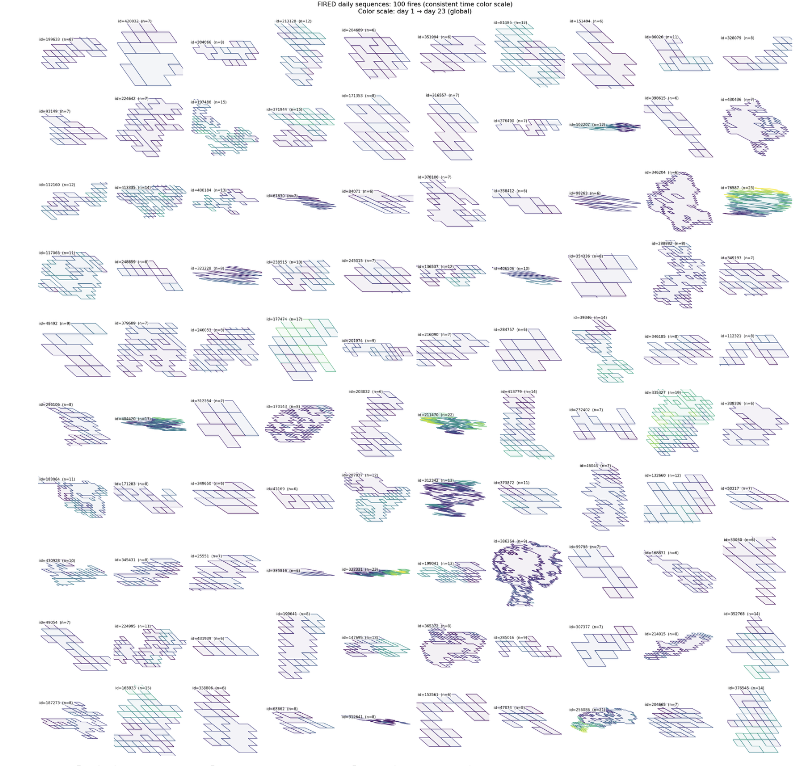

# WaterTipPoint — Building Resilience for the Future

<a href="https://github.com/CU-ESIIL/wildcard-topic-innovation-summit-2025__19/edit/main/docs/index.md" title="Edit this page">✏️</a>

<!-- =========================================================
HERO (Swap hero.jpg, title, strapline, and the three links)
========================================================= -->

[Raw photo location: hero.jpg](https://github.com/CU-ESIIL/wildcard-topic-innovation-summit-2025__19/blob/main/docs/assets/hero.jpg)

**One sentence on impact:** Group 19 at HydroFutures / WaterTipPoint is prototyping solutions that empower communities and markets to proactively manage scarce water resources, turning a global tipping point into an opportunity for sustainable resilience and equitable access.

**[Project brief (PDF)](assets/Seven%20ways%20to%20measure%20fire%20polygon%20velocity-4.pdfa) · [View shared code](https://github.com/CU-ESIIL/wildcard-topic-innovation-summit-2025__19/blob/main/code/fired_time_hull_panel.ipynb) · [Explore data](https://github.com/CU-ESIIL/wildcard-topic-innovation-summit-2025__19/blob/main/code/prism_quicklook.py)**

> **About this site:**
Welcome to HydroFutures / WaterTipPoint, the official project hub for Group 19’s work at the 2025 Innovation Summit. This site showcases our prototyping efforts to empower communities and markets in managing scarce water resources.

Through innovative approaches, research, and collaboration, we aim to turn the global water scarcity tipping point into an opportunity for sustainable resilience, equitable access, and climate-smart solutions.

Here, you’ll find:

Project updates and prototypes

Data and resources for water management

Collaboration opportunities for co-founders, researchers, and partners

Join us in shaping the future of water.

---

## How to use this page (for the team)
- **Edit this file:** `docs/index.md` → ✎ → change text → **Commit changes**.
- **Add images:** upload to `docs/assets/` and reference like `assets/your_file.png`.
- Keep **text short** and **visuals first**. Think “slide captions,” not essays.

---

## Day 1 — Define & Explore
Focus: Questions, Hypotheses, Context

Questions we are exploring:

How can communities and markets better manage scarce water resources?

What digital tools or platforms can increase transparency, fairness, and resilience in water allocation?

How can we prototype scalable solutions for regions facing severe water stress?

Hypotheses:

Transparent, data-driven water management systems will improve equitable access and reduce resource waste.

Community-driven reporting and real-time tracking can identify critical issues faster than traditional methods.

Pilot programs in water-stressed regions can inform globally applicable best practices.

Context:

Water scarcity is a global tipping point affecting billions of people, with urgent social, economic, and environmental consequences. Our work focuses on regions with acute water stress, including the Western U.S. (Utah), North Africa (Morocco), and the Middle East (Saudi Arabia).

Visual:

Coming Soon: Include a photo of your whiteboard or notes from brainstorming sessions — for example, sketches of OpenMap flows, water market concepts, or team discussions.

### Our product 📣

We are prototyping WaterTipPoint, a digital platform that empowers communities, businesses, and local authorities to better understand, monitor, and manage water resources in regions facing scarcity.

Key Features (Conceptual, Not Technical Details):

Community-driven reporting of water issues (shortages, leaks, quality problems)

Visualizing water challenges on interactive maps

Facilitating data-informed decisions for fair and resilient water management

Goal:
To transform water scarcity from a critical tipping point into an opportunity for sustainable access, transparency, and climate resilience.

### Our question(s) 📣
<!-- EDIT: Replace bullets with your own. Encourage divergent takes. -->
What are we trying to understand or change?

How can communities and markets proactively manage scarce water resources to ensure fair access and long-term resilience?

Why now? Why here?

Water scarcity is reaching critical levels globally, with billions affected annually.

Regions like the Western U.S. (Utah), North Africa (Morocco), and the Middle East (Saudi Arabia) are experiencing extreme stress, making it urgent to test and prototype solutions locally.

Who benefits if we succeed?

Local communities gain reliable and equitable access to water.

Governments and utilities can manage resources more efficiently.

Businesses, researchers, and policymakers can leverage data for sustainable planning and climate resilience.

### Hypotheses / intentions [Optional: probably not relevant if you are creating an educational tool]
<!-- EDIT: Plain language, short and honest. -->
- We think that …
- We intend to test whether …
- We will know we’re onto something if …

### Why this matters (the “upshot”) 📣
<!-- EDIT: 2–3 sentences max, decision-oriented. -->
Explain who is impacted and how this could change decisions or understanding.

### Inspirations (papers, datasets, tools)
<!-- EDIT: Swap in your own links. -->
- Publication: [Influential paper title](https://doi.org/xxxx)
- Dataset portal: [Example data hub](https://example.org)
- Tool/tech: [Method or library](https://example.org)

### Field notes / visuals
<!-- EDIT: Replace with a real smartphone photo or sketch; keep filename simple. -->

[Raw photo location: day1_whiteboard.jpg](https://github.com/CU-ESIIL/wildcard-topic-innovation-summit-2025__19/blob/main/docs/assets/day1_whiteboard.jpg)
*Caption: What this shows and why it’s useful today.*

> **Different perspectives:** Briefly capture disagreements or alternate framings. These can unlock innovation.

---

## Day 2 — Data & Methods
*Focus: what we’re testing and building; show a first visual (plot/map/screenshot/GIF).*

### Data sources we’re exploring 📣
<!-- EDIT: Link each source; add size/notes if relevant. -->
- **Source A**

  
[Raw photo location: explore_data_plot.png](https://github.com/CU-ESIIL/wildcard-topic-innovation-summit-2025__19/blob/main/docs/assets/explore_data_plot.png)
  *Snapshot showing initial data patterns.*

- Source B — link and 1-line description

### Methods / technologies we’re testing 📣
- Approach 1 (e.g., time-series break detection)
- Approach 2 (e.g., random forest on features)
- Visualization (e.g., map tiles, small multiples)

### Challenges identified
- Data gaps / quality issues
- Method limitations / compute constraints
- Open questions we need to decide on

### Visuals
<!-- EDIT: Swap examples; keep file sizes modest. -->
#### Static figure

[Raw photo location: figure1.png](https://github.com/CU-ESIIL/wildcard-topic-innovation-summit-2025__19/blob/main/docs/assets/figure1.png)
*Figure 1.* One line on what this suggests.

#### Animated change (GIF)

[Raw photo location: change.gif](https://github.com/CU-ESIIL/wildcard-topic-innovation-summit-2025__19/blob/main/docs/assets/change.gif)
*Figure 2.* One line on what changes across time.

#### Interactive map (iframe)
<iframe
  title="Study area (OpenStreetMap)"
  src="https://www.openstreetmap.org/export/embed.html?bbox=-105.35%2C39.90%2C-105.10%2C40.10&layer=mapnik&marker=40.000%2C-105.225"
  width="100%" height="360" frameborder="0"></iframe>

<a href="https://www.openstreetmap.org/?mlat=40.000&mlon=-105.225#map=12/40.0000/-105.2250">Open full map</a>

> If an embed doesn’t load, put the normal link directly under it.

---

## Final Share Out — Insights & Sharing 
*Focus: synthesis; highlight 2–3 visuals that tell the story; keep text crisp. Practice a 2-minute walkthrough of the homepage 📣: Why → Questions → Data/Methods → Findings → Next.*

[Raw photo location: team_photo.jpg](https://github.com/CU-ESIIL/wildcard-topic-innovation-summit-2025__19/blob/main/docs/assets/team_photo.jpg)

### Findings at a glance 📣
<!-- EDIT: 2–4 bullets, each a headline in plain language with a number if possible. -->
- Headline 1 — what, where, how much
- Headline 2 — change/trend/contrast
- Headline 3 — implication for practice or policy

### Visuals that tell the story 📣
<!-- EDIT: Swap visuals; prioritize clarity. -->

[Raw photo location: fire_hull.png](https://github.com/CU-ESIIL/wildcard-topic-innovation-summit-2025__19/blob/main/docs/assets/fire_hull.png)
*Visual 1.* Swap in the primary graphic that clearly communicates your core takeaway.

[Raw photo location: hull_panels.png](https://github.com/CU-ESIIL/wildcard-topic-innovation-summit-2025__19/blob/main/docs/assets/hull_panels.png)
*Visual 2.* Use a complementary panel, collage, or set of snapshots that reinforces supporting evidence.

[Raw photo location: main_result.png](https://github.com/CU-ESIIL/wildcard-topic-innovation-summit-2025__19/blob/main/docs/assets/main_result.png)
*Visual 3.* Highlight an additional visual that captures a secondary insight or next step.

<iframe
  title="Short explainer video (optional)"
  width="100%" height="360"
  src="https://www.youtube.com/embed/ASTGFZ0d6Ps"
  frameborder="0" allow="accelerometer; autoplay; clipboard-write; encrypted-media; gyroscope; picture-in-picture; web-share"
  allowfullscreen></iframe>

### What’s next? 📣
- Immediate follow-ups
- What we would do with one more week/month
- Who should see this next

---

## Featured links (image buttons)
<!-- EDIT: Replace images/links; keep alt text meaningful and motion subtle. -->
<table>
<tr>
<td align="center" width="33%">
  <a href="assets/Seven%20ways%20to%20measure%20fire%20polygon%20velocity-4.pdfa"> <strong>Read the brief</strong></a>
</td>
<td align="center" width="33%">
  <a href="https://github.com/CU-ESIIL/wildcard-topic-innovation-summit-2025__19/blob/main/code/fired_time_hull_panel.ipynb"> <strong>View code</strong></a>
</td>
<td align="center" width="33%">
  <a href="https://github.com/CU-ESIIL/wildcard-topic-innovation-summit-2025__19/blob/main/code/prism_quicklook.py"> <strong>Explore data</strong></a>
</td>
</tr>
</table>

---

## Team
| Name | Role | Contact | GitHub |
|------|------|---------|--------|
| _Add your teammate_ | _Role_ | _email or preferred contact_ | @_github_ |
| _Add your teammate_ | _Role_ | _email or preferred contact_ | @_github_ |

---

## Storage

Code
Keep shared scripts, notebooks, and utilities in the [`code/`](https://github.com/CU-ESIIL/wildcard-topic-innovation-summit-2025__19/tree/main/code) directory. Document how to run them in a README or within the files so teammates and visitors can reproduce your workflow.

Documentation
Use the [`docs/`](https://github.com/CU-ESIIL/wildcard-topic-innovation-summit-2025__19/tree/main/docs) folder to publish project updates on this site. Longer internal notes can live in [`documentation/`](https://github.com/CU-ESIIL/wildcard-topic-innovation-summit-2025__19/tree/main/documentation); summarize key takeaways here so the public story stays current.

---

## Cite & reuse
If you use these materials, please cite:

> ESIIL Innovation Summit Team 19. (2025). *Wildcard Topic Innovation Summit 2025 project hub*. https://github.com/CU-ESIIL/wildcard-topic-innovation-summit-2025__19

License: CC-BY-4.0 unless noted. See dataset licenses on the **[Data](data.md)** page.

---

<!-- EDIT HINTS
- Upload images to docs/assets/ and reference as assets/filename.png
- Keep images ~1200 px wide; avoid >5–8 MB per file.
- Use short, active sentences; this is a scrolling “slide deck.”
- Update this page at least once per day during the sprint.
-->
